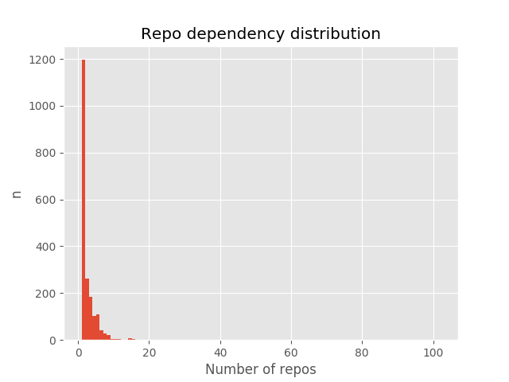

Our goal was to identify the most common open source dependencies used in software for oil and gas exploration and extraction. A lot of software used by the oil and gas industry is closed source, so we can only infer what typical open source packages are used based on the relatively few public repos that are available.

1. `get_repos.py`

We searched GitHub for topics related to oil and gas exploration and extraction ([see here for the full list](topics.txt)), and scraped all repos that fall under these topics. We also checked other co-occurring topics to expand the search further.

We also collected repos under specific search terms ([see here for the full list](terms.txt)) because many repos do not tag the relevant topics.

We tried searching through the GitHub organization accounts of some prominent oil and gas companies, but most had no or very few public repos (if they had a GitHub account at all).

2. `get_deps.py`

For each of the collected repos we then use [GitHub's dependency graph feature](https://help.github.com/en/articles/listing-the-packages-that-a-repository-depends-on) to identify a repo's dependencies. This relies on the repo using a standard format, e.g. `requirements.txt` for Python projects, so if a project is using a non-standard format (or fails to report dependencies at all), then we skip that repo.

3. `results.py`

Out of the 651 repos we crawled, 147 had dependencies that GitHub could parse. The full results are presented in [`results/index.html`](results/index.html).

The top five dependencies are:

- /numpy/numpy (97)
- /matplotlib/matplotlib (72)
- /scipy/scipy (70)
- /pandas-dev/pandas (43)
- /pytest-dev/pytest (36)

Some of these dependencies have overlap, e.g. `scipy` and `pandas` both also have `numpy` as a dependency.

The overall distribution is long-tail, indicating that, aside from a few dominant repos, most dependencies are scarce, so a wide adoption of the license will provide the most coverage:

